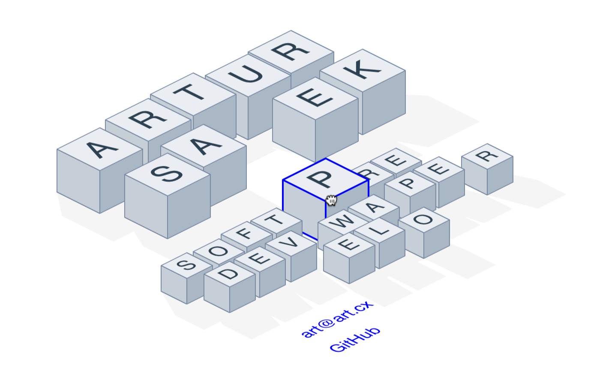

<p align=center><a href="https://art.cx"></a></p>

# Isometric cube home page

This is a little Rust WASM toy I wrote for fun recently. It renders a bunch of cubes
which spell my name. They can be dragged around and push each other.

The isometric "physics" was written from scratch; it's very simple and not a full physics engine by any means.

It's written using [`web_sys`](https://docs.rs/web-sys/latest/web_sys/), and [`geo`](https://docs.rs/geo/latest/geo/) for basic geometric operations.

Try it live here: [https://art.cx](https://art.cx)

## Setup

The website is a tiny [`axum`](https://github.com/tokio-rs/axum/tree/main) server, which as of now just serves some static assets.

To build the full server locally:

```
bash build.sh
```

Then to run it:

```
cd dist
./server
```

This should run the server at localhost:80.

Alternatively, you can run only the cube page with auto recompiling:

```
cd cubes
npm run dev
```

This should run a webpack dev server on localhost:8080 or similar.
